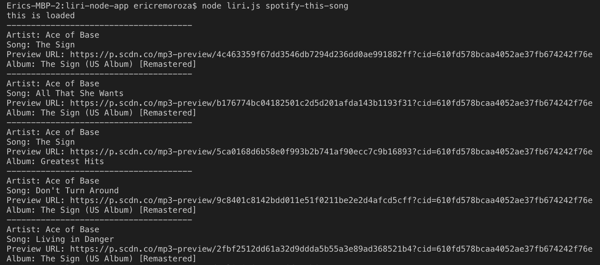

# LIRI Node App

Language Interpretation and Recognition Interface.

* Operated in a command line, this application receives parameters and returns data.

### Technologies Used
* Request NPM
```
npm install request
```
* fs NPM
```
npm install fs
```
* Spotify NPM
```
npm install node-spotify-api
```
* NodeJS


## LIRI in Action
If no title is added after "movie-this"... 

... the command line would output data for "Mr. Nobody".


Adding a movie title after "movie-this"


No artist name entered...


Artist name entered... 


Default Spotify Result




Spotify Input


Reading off text file


### Useful Notes

If you're on a public network, to run a command, make sure to put the objective in quotation marks, like so:
```
node liri.js movie-this "The Karate Kid"
```

```
node liri.js concert-this "Elton John"
```